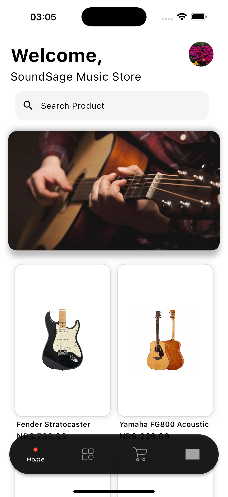

# Music Instrument Ecommerce App

This is a Flutter-based eCommerce application for purchasing musical instruments. The app follows **Clean Architecture** principles and uses **Hive** for local data storage, with **Node.js** handling the remote data source.

## Features

- **Login & Signup:** Users can sign up for a new account and log in to their existing account.
- **Browse Products:** Users can browse a variety of musical instruments.
- **Add to Cart:** Add selected items to the shopping cart for later purchase.
- **Checkout:** Complete the purchase with integrated payment options.
- **Delivery Options:** Choose from different delivery methods for your purchased items.

## Architecture

This app follows **Clean Architecture**, ensuring modularity, scalability, and maintainability. The architecture separates the business logic from UI, and provides clear layers for data management and presentation.

## Tech Stack

- **Flutter** & **Dart** for cross-platform mobile development.
- **Hive** for local data storage.
- **Node.js** for the backend (remote data source/API).

## Setup Instructions

### Prerequisites

Make sure you have the following installed:

- Flutter SDK
- Dart SDK
- Node.js (for backend)
- Hive package for local data storage

### Local Setup

1. **Clone the Repository:**
   ```bash
   git clone 
Flutter Setup: Navigate to the project directory and install dependencies:

bash
Copy
cd your_project_name
flutter pub get
Backend Setup (Node.js):

bash
Copy
npm start
Running the App: Now, you can run the Flutter app on your preferred platform (Android or iOS):

bash
Copy
flutter run
Screenshots
Here are some screenshots from the app:

{: width="500px" height="300px"}
{: width="500px" height="300px"}
{: width="500px" height="300px"}
{: width="500px" height="300px"}
{: width="500px" height="300px"}
{: width="500px" height="300px"}
{: width="500px" height="300px"}
{: width="500px" height="300px"}
{: width="500px" height="300px"}